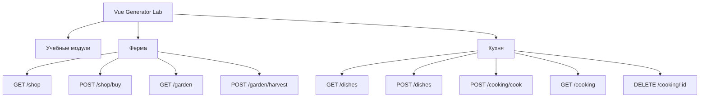

<div align="center">

# Vue Work Lab
### Учебный SPA-проект на Vue 3 с интерактивными модулями, фермой и симуляцией готовки

Практический проект для изучения компонентов, событий, `props`, `$emit`, работы с API, формами и серверной логикой на Express.

---

[](https://github.com/DIBERLOG/work_project)
[](https://vuejs.org/)
[](https://vite.dev/)
[](https://expressjs.com/)

</div>

---

## О проекте

`Vue Work Lab` это большая учебная страница, в которой собрано несколько независимых мини-приложений. Проект показывает, как в одном интерфейсе можно объединить разные паттерны работы Vue: от простых счетчиков и выбора языка до более живых сценариев с покупкой растений, сбором урожая, созданием блюд и отслеживанием процесса готовки.

Приложение состоит из клиентской части на `Vue 3 + Vite` и серверной части на `Express`. Сервер отдает API для фермы и кухни, а в production также раздает собранный фронтенд из папки `dist`.

---

## Основные возможности

✅ Единая длинная страница с быстрой навигацией по разделам  
✅ Учебные модули для практики `props`, `$emit`, форм, списков и реактивности  
✅ Интерактивная ферма с магазином, балансом, посадкой растений и сбором урожая  
✅ Динамическое обновление цен в магазине и таймер роста растений  
✅ Раздел кухни с карточками блюд, созданием рецептов и симуляцией готовки  
✅ Автообновление состояния приготовления блюд через API  
✅ Работа с HTTP-запросами через `axios`  
✅ Адаптивный интерфейс для десктопа и мобильных устройств  

---

## Ключевые модули

### Ферма
- Магазин растений с изменяемыми ценами покупки и продажи
- Виртуальный баланс пользователя
- Посадка нескольких растений за одно действие
- Созревание урожая по времени и сбор по клику

### Кухня
- Просмотр списка блюд
- Открытие полного рецепта
- Добавление новых блюд через форму
- Отправка блюда в готовку
- Отображение прогресса приготовления
- Удаление блюда из каталога и из очереди готовки

### Учебные блоки Vue
- Блог
- Книги
- Счетчик
- Галерея
- Выбор языка
- Текстовый анализатор
- Практика `props + $emit`
- Тестовый блок
- Курс Bitcoin
- Определение возраста
- Трекер посылок
- Голосование

---

## Технологический стек

<p align="center">

| Раздел | Технологии |
|--------|------------|
| Frontend | Vue 3, TypeScript, Vite |
| UI | Bootstrap 5, кастомные стили, адаптивная верстка |
| Backend | Node.js, Express 5, CORS |
| HTTP | Axios |
| Dev | Nodemon, vue-tsc, npm-run-all2 |

</p>

---

## Структура проекта



---

## Запуск проекта

### 1. Установка зависимостей

```bash
npm install
```

### 2. Запуск фронтенда

```bash
npm run dev
```

### 3. Запуск сервера

```bash
npm run server
```

По умолчанию API доступно на `http://localhost:3005`.

### 4. Production-сборка

```bash
npm run build
```

### 5. Запуск production-сервера

```bash
npm start
```

---

## API-эндпоинты

### Ферма
- `GET /shop` - получить магазин растений
- `GET /user` - получить баланс пользователя
- `GET /garden` - получить список растений в огороде
- `POST /shop/buy` - купить и посадить растения
- `POST /garden/harvest` - собрать урожай

### Кухня
- `GET /dishes` - получить список блюд
- `GET /dish?id=...` - получить конкретный рецепт
- `POST /dishes` - создать новое блюдо
- `DELETE /dishes/:id` - удалить блюдо
- `POST /cooking/cook` - отправить блюдо в готовку
- `GET /cooking` - получить текущий статус готовки
- `DELETE /cooking/:id` - удалить блюдо из готовки

---

## Для чего сделан проект

Этот проект полезен как учебная база для практики:

- компонентного подхода во Vue
- передачи данных между компонентами
- работы с пользовательскими событиями
- отправки и получения данных с сервера
- построения интерфейсов с несколькими независимыми модулями
- организации простого fullstack-проекта на `Vue + Express`

---

<div align="center">

Проект сделан как учебная практика по Vue и генерации пользовательских событий.

</div>
